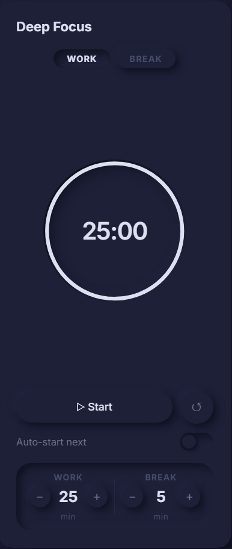
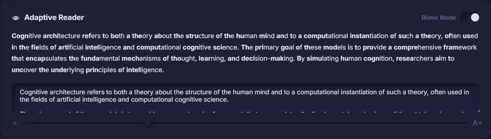
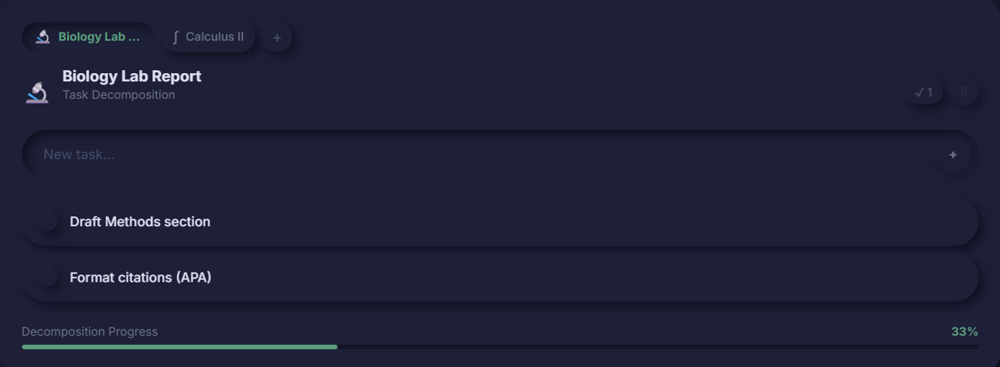
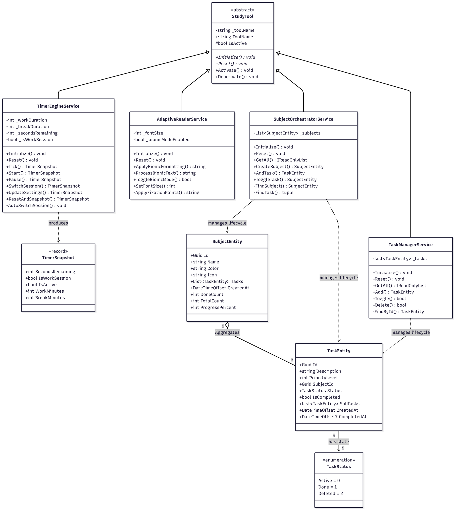

<div align="center">
  <br>
  
  <h1>↺ &nbsp;FocusFlow</h1>
  <h4>A distraction-free, Neumorphic productivity suite for deep work — built with ASP.NET Core and React.</h4>

  <p align="center">
    <a href="#-features">Features</a> •
    <a href="#-tech-stack">Tech Stack</a> •
    <a href="#-getting-started">Getting Started</a> •
    <a href="#-system-architecture">Architecture</a> •
    <a href="#-ui-design-system">UI Design</a> 
  </p>
</div>

---

**FocusFlow** is a minimalist productivity portal that merges a server-synced Pomodoro timer, a Bionic speed-reader, and a subject-based task orchestrator into a single, distraction-free workspace. The UI is built on a fully custom monochromatic Neumorphic design system with pixel-perfect dark mode support — zero hardcoded color values, all depth from shadows.

> ⭐ If FocusFlow helps you stay in the zone, give it a star — it helps the project grow!

---

## 📸 Screenshots

| Deep Focus Timer | Adaptive Reader | Task Decomposer |
|:---:|:---:|:---:|
|  |  |  |

---

## Table of Contents

- [Features](#-features)
- [Tech Stack](#-tech-stack)
- [Getting Started](#-getting-started)
- [System Architecture](#-system-architecture)
- [UI Design System](#-ui-design-system)
- [Roadmap](#-roadmap)

---

## ✨ Features

### ⏱️ Deep Focus Timer (Pomodoro)

A server-authoritative Pomodoro timer that eliminates browser tab-throttling drift by delegating all time-keeping to the C# backend.

- **SVG progress ring** — circular countdown fully synced with `GET /api/focus/timer`
- **Configurable sessions** — work (1–120 min) and break (1–60 min) via ± stepper controls
- **Session badges** — click to manually switch Work ↔ Break at any time; auto-update on session end
- **Three-tone ascending chime** — synthesized via Web Audio API, no external files required
- **Auto-start toggle** — continuous Pomodoro flow with zero interruption
- **Stable tick** — `setInterval` stabilized through React `useRef`; zero jitter during countdown
- **Offline fallback** — runs fully client-side if the backend is unavailable

---

### 📖 Adaptive Reader

An in-browser reading accelerator that implements the **Bionic Reading** algorithm to reduce subvocalization and increase throughput.

- **Bionic boldening** — first 40% of each word is bolded to anchor visual fixation
- **Toggle view** — switch between bionic-processed and plain text instantly
- **Adjustable font size** — range slider for comfortable reading at any size

---

### 📋 Task Decomposer (Subject Orchestrator)

A subject-centric task manager designed for students and focused workers who group tasks by domain.

- **Subjects as containers** — create contexts like "Calculus II" or "Biology" to group related tasks
- **Full task lifecycle** — add, complete (toggle), or permanently delete tasks within any subject
- **Cascade delete** — removing a subject deletes all its tasks in a single action
- **Decomposition progress bar** — live `% of tasks completed` per subject, updated on every state change
- **Framer Motion animations** — smooth enter/exit transitions for task state changes
- **Task states**: `Active` → `Done` (toggle) or `Deleted` (permanent)

---

### 🎨 Neumorphic Design System

A fully custom monochromatic design system — all depth is derived from light and shadow variables only.

- **Zero hardcoded `rgba` values** — all shadows are CSS custom properties
- **Dark mode toggle** — `sun/moon` icon in sidebar; seamless CSS variable override via `.dark` on `<html>`
- **Hidden scrollbars** — globally suppressed for an edge-to-edge, seamless layout (still scrollable)
- **`currentColor` SVG logo** — adapts to dark/light mode automatically with no JS
- **Sidebar** — loop logo, dashboard icon, and dark mode toggle only; intentionally minimal

---

## 🛠 Tech Stack

| Layer | Technology | Purpose |
|---|---|---|
| **Frontend** | React 18 + Vite | Component rendering, dev server, HMR |
| **Animations** | Framer Motion | Task list enter/exit transitions |
| **Styling** | Pure CSS (custom properties) | Neumorphic design system, dark mode |
| **Audio** | Web Audio API | Session-complete chime (no external files) |
| **Backend** | ASP.NET Core Web API (.NET 10) | Server-authoritative timer, REST API |
| **State** | In-memory singleton services | Stateless-friendly, no DB dependency |
| **Architecture** | 3-Layer (Presentation / BLL / Data) | Clear separation of concerns |

---

## 🚀 Getting Started

### Prerequisites

| Tool | Version |
|---|---|
| [Node.js](https://nodejs.org/) | v18+ |
| [.NET SDK](https://dotnet.microsoft.com/download/dotnet/10.0) | 10.0+ |
| Git | any |

---

### 1. Clone the Repository

```bash
git clone https://github.com/l4hgs/FocusFlow.git
cd FocusFlow
```

---

### 2. Start the Backend

```bash
cd backend
dotnet run
```

> The API starts at `http://localhost:5000`. The Vite dev proxy automatically forwards all `/api/*` requests — no CORS configuration needed during development.

> **Tip (Windows):** If you see a build lock error because `FocusFlow.API.exe` is already running:
> ```powershell
> Stop-Process -Name "FocusFlow.API" -Force
> ```

---

### 3. Start the Frontend

```bash
cd frontend
npm install
npm run dev
```

> The UI starts at `http://localhost:5173`.

---

### Quick Reference

| Command | What it does |
|---|---|
| `dotnet run` | Starts ASP.NET Core API on port 5000 |
| `npm run dev` | Starts Vite dev server on port 5173 |
| `npm run build` | Produces optimized production bundle |
| `dotnet publish` | Produces self-contained .NET binary |

[↑ Back to top](#table-of-contents)

---

## 🏗 System Architecture

FocusFlow follows a strict **3-Layer Architecture** on the backend, with the React frontend acting as a thin client that owns no business logic.

---

### Architecture Overview

```
┌─────────────────────────────────────────────────────────────────────┐
│                          CLIENT (Browser)                           │
│                                                                     │
│   ┌──────────────┐   ┌──────────────────┐   ┌──────────────────┐    │
│   │ SensoryTimer │   │  AdaptiveReader  │   │ TaskDecomposer   │    │
│   │    .jsx      │   │      .jsx        │   │     .jsx         │    │
│   └──────┬───────┘   └────────┬─────────┘   └─────────┬────────┘    │
│          │                    │                       │             │
│          └────────────────────┼───────────────────────┘             │
│                               │  HTTP / JSON (via Vite proxy)       │
└───────────────────────────────┼─────────────────────────────────────┘
                                │
                                ▼
┌─────────────────────────────────────────────────────────────────────┐
│                     PRESENTATION LAYER  (ASP.NET Core)              │
│                                                                     │
│              ┌──────────────────────────────────┐                   │
│              │       FocusController.cs         │                   │
│              │  GET  /api/focus/timer           │                   │
│              │  POST /api/focus/timer/start     │                   │
│              │  POST /api/focus/timer/stop      │                   │
│              │  GET  /api/focus/subjects        │                   │
│              │  POST /api/focus/subjects        │                   │
│              │  DELETE /api/focus/subjects/{id} │                   │
│              │  GET  /api/focus/tasks           │                   │
│              │  POST /api/focus/tasks           │                   │
│              │  PATCH /api/focus/tasks/{id}     │                   │
│              │  DELETE /api/focus/tasks/{id}    │                   │
│              └──────────────┬───────────────────┘                   │
└─────────────────────────────┼───────────────────────────────────────┘
                              │  Injected via DI (singleton)
                              ▼
┌─────────────────────────────────────────────────────────────────────┐
│                  BUSINESS LOGIC LAYER  (Services)                   │
│                                                                     │
│  ┌──────────────────┐  ┌────────────────────────────┐               │
│  │TimerEngineService│  │ SubjectOrchestratorService │               │
│  │                  │  │                            │               │
│  │ _workDuration    │  │ CreateSubject()            │               │
│  │ _breakDuration   │  │ DeleteSubject()            │               │
│  │ _isRunning       │  │ GetAllSubjects()           │               │
│  │ _sessionType     │  └─────────────┬──────────────┘               │
│  │                  │                │  uses                        │
│  │ Start()          │  ┌─────────────▼──────────────┐               │
│  │ Stop()           │  │    TaskManagerService      │               │
│  │ GetState()       │  │                            │               │
│  └──────────────────┘  │ AddTask()                  │               │
│                        │ CompleteTask()             │               │
│  ┌──────────────────┐  │ DeleteTask()               │               │
│  │AdaptiveReaderSvc │  │ GetTasksBySubject()        │               │
│  │                  │  └────────────────────────────┘               │
│  │ ProcessText()    │                                               │
│  │ ApplyBionic()    │                                               │
│  └──────────────────┘                                               │
└─────────────────────────────┬───────────────────────────────────────┘
                              │  Reads / writes
                              ▼
┌─────────────────────────────────────────────────────────────────────┐
│                      DATA LAYER  (Entities)                         │
│                                                                     │
│   ┌──────────────┐   ┌──────────────────┐   ┌──────────────────┐    │
│   │  StudyTool   │   │  SubjectEntity   │   │   TaskEntity     │    │
│   │   (base)     │◄──│                  │◄──│                  │    │
│   │              │   │  Id: Guid        │   │  Id: Guid        │    │
│   │  Id          │   │  Name: string    │   │  SubjectId: Guid │    │
│   │  CreatedAt   │   │  Tasks: List<>   │   │  Title: string   │    │
│   └──────────────┘   └──────────────────┘   │  Status: enum    │    │
│                                             └──────────────────┘    │
│                      ┌──────────────────┐                           │
│                      │   TaskStatus     │                           │
│                      │   (enum)         │                           │
│                      │  Active          │                           │
│                      │  Done            │                           │
│                      │  Deleted         │                           │
│                      └──────────────────┘                           │
└─────────────────────────────────────────────────────────────────────┘
```

---

### UML Class Diagram



---

### Component Interaction (UML Sequence — Pomodoro Tick)

The frontend polls the backend every 10 seconds to stay in sync. Below is the request lifecycle for a single timer poll:

```
Browser (SensoryTimer.jsx)          ASP.NET Core (FocusController)       TimerEngineService
          │                                      │                                │
          │── GET /api/focus/timer ─────────────►│                                │
          │                                      │── GetState() ─────────────────►│
          │                                      │                                │── compute elapsed
          │                                      │◄── TimerStateDto ──────────────│
          │                                      │    { isRunning,                │
          │                                      │      elapsed,                  │
          │                                      │      workMinutes,              │
          │                                      │      breakMinutes,             │
          │                                      │      sessionType }             │
          │◄── 200 OK (JSON) ─────────────────── │                                │
          │                                      │                                │
          │  [React reconciles SVG ring]         │                                │
          │  [No re-render if state unchanged]   │                                │
```

---

### Component Interaction (UML Sequence — Task Lifecycle)

```
Browser (TaskDecomposer.jsx)         FocusController          SubjectOrchestratorService   TaskManagerService
          │                                │                            │                         │
          │── POST /api/focus/subject s───►│                            │                         │
          │   { name: "Calculus II" }      │── CreateSubject() ────────►│                         │
          │                                │                            │── new SubjectEntity     │
          │◄── 201 Created ────────────────│◄── SubjectDto ─────────────│                         │
          │                                │                            │                         │
          │── POST /api/focus/tasks ──────►│                            │                         │
          │   { subjectId, title }         │── AddTask() ────────────────────────────────────────►│
          │                                │                            │           new TaskEntity│
          │◄── 201 Created ────────────────│◄─────────────────────────────────────── TaskDto ─────│
          │                                │                            │                         │
          │── PATCH /api/focus/tasks/{id}─►│                            │                         │
          │   { status: "Done" }           │── CompleteTask() ───────────────────────────────────►│
          │                                │                            │        status = Done    │
          │◄── 200 OK ─────────────────────│◄─────────────────────────────────────── TaskDto ─────│
          │                                │                            │                         │
          │  [Progress bar recalculates]   │                            │                         │
```

---

### Architecture Layers Summary

| Layer | Responsibility | Key Classes |
|---|---|---|
| **Presentation** | HTTP routing, request/response mapping, input validation | `FocusController.cs` |
| **Business Logic** | Domain rules, timer state, task lifecycle, bionic processing | `TimerEngineService`, `SubjectOrchestratorService`, `TaskManagerService`, `AdaptiveReaderService` |
| **Data** | Entity definitions, enums, in-memory collections | `SubjectEntity`, `TaskEntity`, `StudyTool`, `TaskStatus` |
| **Frontend (Client)** | UI rendering, user interaction, polling, offline fallback | `SensoryTimer.jsx`, `AdaptiveReader.jsx`, `TaskDecomposer.jsx` |

---

### Key Design Decisions

**Server-authoritative timer**
`TimerEngineService` holds `_workDuration` and `_breakDuration` in seconds. Every `GET /timer` response includes `workMinutes` and `breakMinutes`, so the frontend always has a source of truth — browser tab throttling cannot cause drift.

**Aggregation over composition in task management**
`SubjectOrchestratorService` uses **Aggregation**: a `SubjectEntity` owns a `List<TaskEntity>`. Cascade delete is O(1) from the subject — no orphaned task cleanup needed.

**Stable React interval**
The `tick` callback has an **empty dependency array** and reads all mutable values through `useRef`. This keeps `setInterval` stable and prevents countdown jitter during re-renders.

**No database dependency**
Services are registered as in-memory singletons. The architecture is designed so swapping to EF Core + a real DB requires only a Data Layer change — the BLL and Presentation layers are unaffected.

[↑ Back to top](#table-of-contents)

---

## 🎨 UI Design System

All design tokens live in `frontend/src/index.css` as CSS custom properties. Dark mode is activated by adding `.dark` to `<html>` — every variable overrides automatically with no JavaScript color logic.

### Design Tokens

| Variable | Purpose |
|---|---|
| `--bg` / `--surface` | Base and card background (same value — depth from shadows only) |
| `--shadow-out` / `--shadow-out-sm` | Raised element shadows (neumorphic lift) |
| `--shadow-in` / `--shadow-in-deep` | Pressed / inset shadows (neumorphic depression) |
| `--shadow-out-hover` | Hover-state raised shadow |
| `--shadow-sidebar` | Sidebar right-edge shadow |
| `--timer-track` | SVG circular progress ring track color |
| `--text-primary` | Primary readable text |
| `--text-secondary` | Supporting labels and descriptions |
| `--text-muted` | Disabled states, placeholders |

### Dark Mode

```css
/* Light (default) */
:root {
  --bg: #e0e5ec;
  --surface: #e0e5ec;
  --shadow-out: 6px 6px 12px #b8bec7, -6px -6px 12px #ffffff;
  --shadow-in: inset 4px 4px 8px #b8bec7, inset -4px -4px 8px #ffffff;
  --text-primary: #2d3748;
}

/* Dark — toggled via .dark on <html> */
html.dark {
  --bg: #1e2228;
  --surface: #1e2228;
  --shadow-out: 6px 6px 12px #16191e, -6px -6px 12px #262d36;
  --shadow-in: inset 4px 4px 8px #16191e, inset -4px -4px 8px #262d36;
  --text-primary: #e2e8f0;
}
```

[↑ Back to top](#table-of-contents)

---

## 🗺 Roadmap

- [ ] **Persistent storage** — swap in-memory singletons for EF Core + SQLite/PostgreSQL
- [ ] **User accounts** — JWT authentication for multi-user support
- [ ] **Task priorities** — High / Medium / Low with visual indicators
- [ ] **Focus analytics** — Session history, streaks, daily focus time chart
- [ ] **Keyboard shortcuts** — Power-user controls for timer and task actions
- [ ] **PWA support** — Installable, offline-first via service worker
- [ ] **Export** — Download tasks and session logs as CSV / JSON

[↑ Back to top](#table-of-contents)

---

<div align="center">
  <sub>Built with focus. ↺</sub>
</div>
